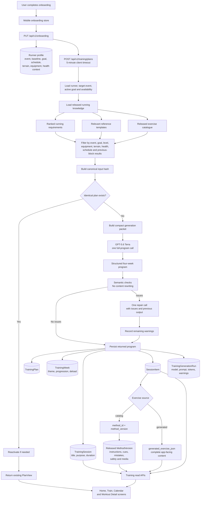
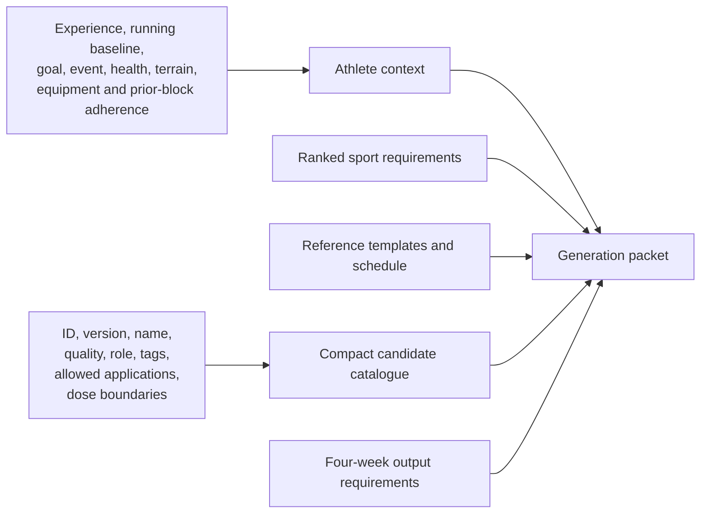
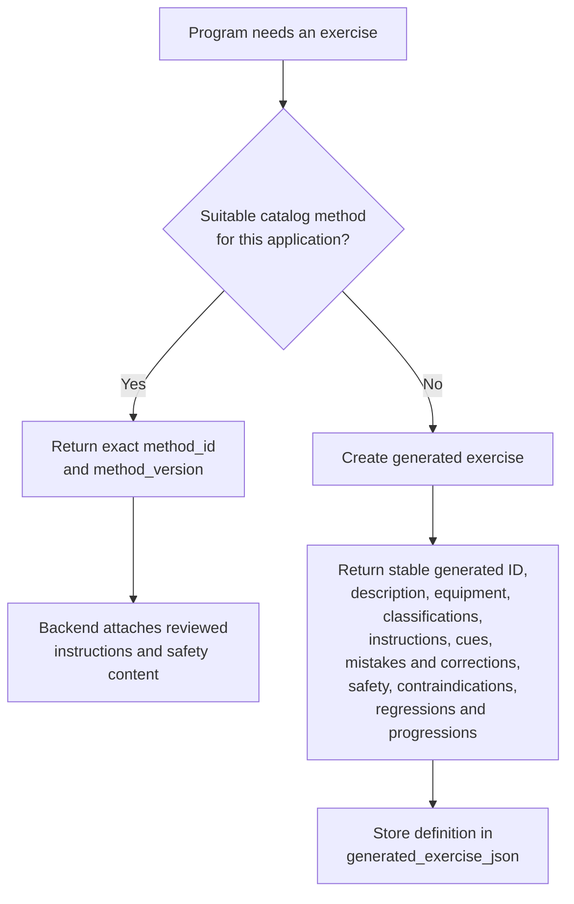
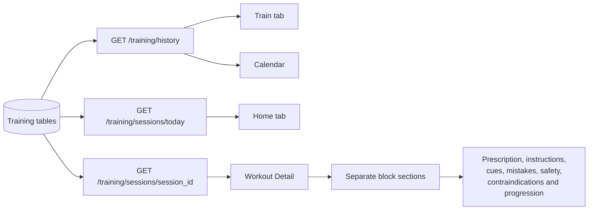

# Training Generation Architecture

This document is the source of truth for Runlete's running-only, four-week training generation flow.

## End-to-end flow



## Generation packet

Only information needed for coaching and selection is sent to Terra.



The packet deliberately excludes catalog instructions, coaching cues, common mistakes, safety paragraphs, and media. The backend attaches those fields from the selected released method version after generation.

## Terra responsibilities

Terra acts as the program architect and strength-and-conditioning coach. It must:

1. Generate exactly four weeks.
2. Generate exactly the requested sessions per week.
3. Preserve the supplied session dates.
4. Make every session fit the selected 90, 120, or 150-minute duration.
5. Use the runner's health context, baseline mileage, recent longest run, interruption, equipment, terrain, target event, and goals.
6. Use templates as programming references rather than fixed plans.
7. Create appropriate warm-up, mobility, activation, speed, plyometric, power, strength, accessory, isometric, conditioning, circuit, cooldown, and stretching blocks.
8. Provide sets, reps, time or distance, intensity, rest, tempo, and circuit timing where applicable.
9. Progress load and complexity coherently across four weeks.
10. Prefer suitable catalog exercises.
11. Create as many missing exercises as the program genuinely needs.
12. Define each generated exercise once and reuse its generated ID throughout the plan.

## Exercise sources



There is no backend limit on the number of generated exercises. The prompt tells Terra to create them only for meaningful catalog gaps and to avoid cosmetic duplicates.

## Validation and repair

The API schema must be valid before the backend can persist or display the response. After schema parsing, the backend checks:

- Week numbering and four-week coverage
- Requested sessions per week
- Session and block duration totals
- Catalog ID and version references
- References to generated exercise definitions

The backend does not normalize or rewrite the model's coaching content. If these checks report issues, Terra receives one repair request. The second returned program is persisted even when semantic warnings remain, and those warnings are recorded in the plan and generation run.

When a later block is requested, the packet also includes the preceding active block's planned and completed session counts, adherence, average completion ratio, average session RPE, and pain-flag count. The new block becomes the sole active plan while the prior block remains available for history.

Transport, authentication, malformed JSON, or database failures remain request failures because there is no usable program to display.

## Persistence model

```mermaid
erDiagram
    TRAINING_PLAN ||--|{ TRAINING_WEEK : contains
    TRAINING_WEEK ||--|{ TRAINING_SESSION : contains
    TRAINING_SESSION ||--|{ SESSION_ITEM : contains
    TRAINING_PLAN ||--o{ TRAINING_GENERATION_RUN : records
    METHOD_VERSION ||--o{ SESSION_ITEM : supplies_catalog_content

    TRAINING_PLAN {
        uuid id
        uuid athlete_id
        string input_hash
        string dataset_hash
        string planner_version
        json input_snapshot_json
        json validation_json
    }
    TRAINING_WEEK {
        int week_number
        bool deload
        json structure_json
    }
    TRAINING_SESSION {
        datetime scheduled_for
        string purpose
        string explanation
        int estimated_minutes
        string load_class
    }
    SESSION_ITEM {
        uuid method_id nullable
        int method_version nullable
        json generated_exercise_json nullable
        string block_type
        json prescription_json
    }
    METHOD_VERSION {
        uuid method_id
        int content_version
        string canonical_name
        json instructions
        json cues
        json common_errors
        json safety_boundaries
    }
    TRAINING_GENERATION_RUN {
        string model_id
        string prompt_version
        int attempt_count
        int input_tokens
        int output_tokens
        json accepted_output_json
        json validation_json
    }
```

Every session item has exactly one source:

- Catalog: `method_id` and `method_version` are populated; `generated_exercise_json` is null.
- Generated: `generated_exercise_json` is populated; catalog reference fields are null.

The database check constraint enforces this rule.

## Read and display flow



The `today` endpoint calculates day boundaries in the athlete's timezone. The Workout Detail screen groups exercises by their generated block type instead of treating every non-warm-up exercise as main work.

## Duplicate request behavior

The backend creates a canonical hash from the athlete context, plan start, schedule, templates, dataset version, and generator version. Before contacting Terra, it searches for the same athlete, input hash, dataset hash, and planner version.

- If found, the saved plan is returned without another model charge.
- If it was superseded, it becomes active again and the currently active plan is superseded.
- If any relevant planning input or version changed, a new plan is generated.

## Operational settings

- Workout model: `gpt-5.6-terra`
- Prompt version: `hybrid-full-program-v3`
- Response schema: `3.0`
- Planner version: `ai-full-program-v3`
- Backend OpenAI timeout: 300 seconds
- Mobile generation timeout: 300 seconds
- Primary calls: one
- Repair calls: at most one

## Main implementation files

- `backend/app/training/ai_selector.py` — prompt, response schema, packet and Terra provider
- `backend/app/training/ai_generation_service.py` — filtering, duplicate lookup, generation, repair and persistence
- `backend/app/training/models.py` — training persistence models
- `backend/app/training/service.py` — catalog/generated exercise read adapter
- `backend/app/training/router.py` — training API routes
- `backend/alembic/versions/20260908_26_generated_plan_exercises.py` — generated-exercise migration
- `backend/alembic/versions/20260908_27_running_only_profiles.py` — runner profile and race-goal fields
- `backend/alembic/versions/20260908_28_running_only_knowledge.py` — destructive non-running knowledge pruning
- `frontend/app/onboarding/generating.tsx` — onboarding generation request and progress UI
- `frontend/src/utils/api.ts` — long-running request support
- `frontend/app/workout/[id].tsx` — workout sections and exercise content display
- `frontend/app/(tabs)/index.tsx` — today's workout adapter
- `frontend/app/(tabs)/train.tsx` — plan history adapter
- `frontend/app/calendar/index.tsx` — calendar workout adapter

Update this document whenever the prompt contract, response schema, retry policy, persistence shape, or frontend mapping changes.
