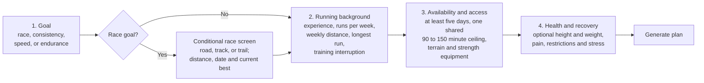
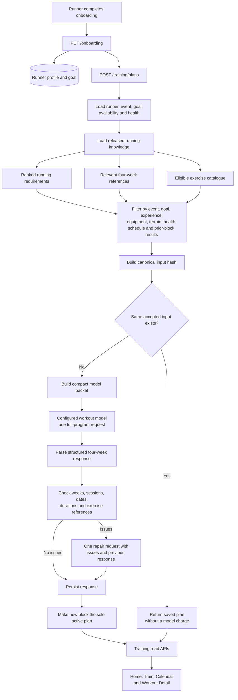
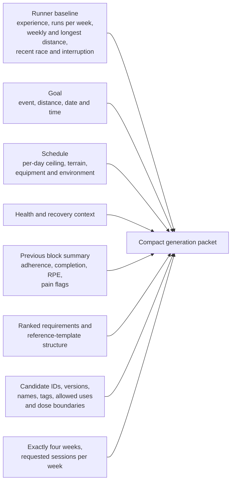
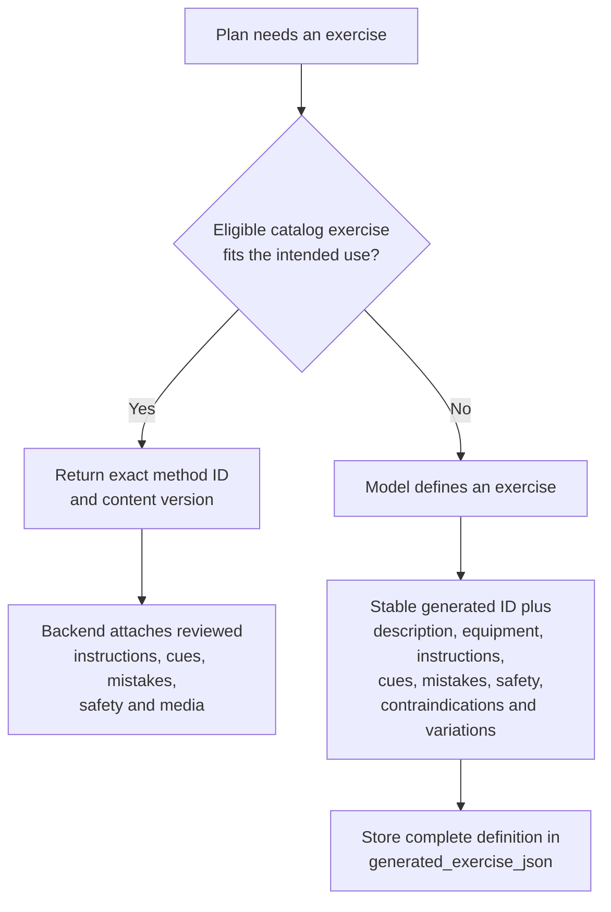
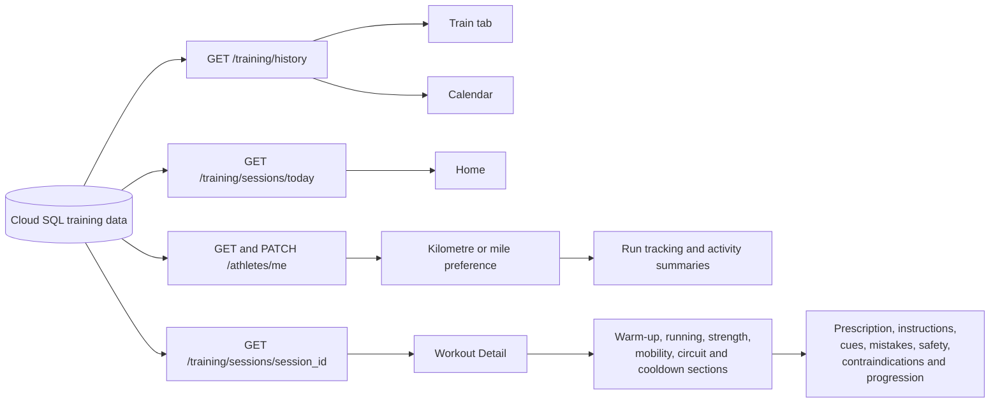

# Runlete Running-Only Architecture

This document is the source of truth for Runlete's running-only onboarding, training generation, persistence, adaptation, and mobile display flow. Update it whenever the onboarding contract, running knowledge, model prompt, response schema, retry behavior, or frontend mapping changes.

## Product boundary

Runlete supports runners from run/walk through sprinting, middle distance, road distance, marathon, and trail running. Running, runner-supporting strength, mobility, recovery, nutrition, routes, races, clubs, leaderboards, and health context remain in scope. Training data owned only by another sport is outside the product and must not be offered by onboarding or selected by plan generation.

Supported event codes are `run_walk`, `100m`, `200m`, `400m`, `800m`, `1500m`, `mile`, `5k`, `10k`, `half_marathon`, `marathon`, and `trail`.

## Onboarding flow



The mobile onboarding store owns temporary form state. The generation screen converts the selected unit to metres, converts time strings to seconds, derives the allowed running and strength environments, and sends two authenticated requests:

1. `PUT /api/v1/onboarding` saves the runner profile, running event, active goal, per-day availability, equipment, terrain, and health context.
2. `POST /api/v1/training/plans` requests the initial four-week block.

The onboarding API creates exactly one primary athlete sport row with `sport_code=running`. Users do not submit arbitrary sport codes, roles, sport practice schedules, exercise familiarity, or push-up, pull-up, and squat test counts.

Race onboarding asks for an optional current personal-best time. For fixed road and track events, the recognized fastest performance is stored automatically as the target time; users do not type a target. Track times preserve hundredth-second precision. Trail races use a custom distance and have no universal record target because courses are not comparable.

## End-to-end generation



## Knowledge selection

Cloud SQL is authoritative. Generation uses only released running content:

- Running sport mode policy
- Exact event, phase, and goal priority rows where available
- Reviewed running reference templates and four-week prescriptions
- Exercise methods linked to retained running templates or running physical qualities
- Phase dose and progression policies

`800m` uses the reviewed `400m` priority family, `1500m` and `mile` use the `5k` family, `trail` uses the `10k` family until event-specific reviewed matrices are published. The actual target event remains in the runner context, so the model adapts the reference family to the requested event.

Non-running sport articles, releases, policies, priorities, taxa, templates, and methods without a running relationship are removed by migration `20260908_28_running_only_knowledge.py`.

## Model input packet

Only information required to design and select the plan is sent to the workout model.



Catalog instructions, cues, common mistakes, detailed safety text, and media are intentionally excluded from the prompt. They are attached from the selected released `MethodVersion` after generation. This keeps input tokens lower without losing reviewed content in the app.

The model is selected with `OPENAI_WORKOUT_MODEL`. Development and production should explicitly set this value; the intended running-plan model is `gpt-5.6-terra`.

## Model responsibilities

The workout model must:

1. Return exactly four numbered weeks and the requested number of sessions per week.
2. Preserve every supplied `scheduled_for` value.
3. Treat each day's selected duration as a ceiling and make block durations equal the session duration.
4. Use the runner's baseline, interruption, health, terrain, equipment, availability, target event, date, and time.
5. Treat templates as reviewed references that may be combined and adapted.
6. Build an integrated running calendar with appropriate easy, long, interval, threshold, hill, sprint, drill, mobility, strength, plyometric, circuit, cooldown, and recovery work.
7. Include purposeful warm-ups and cooldowns for demanding sessions.
8. Supply sets, reps, distance or time, intensity, rest, tempo, and circuit work/recovery timing when applicable.
9. Progress volume, intensity, and complexity coherently across the block.
10. Prefer catalog exercises and reference them by exact method ID and version.
11. Create any number of new exercises when the catalog has a real gap.
12. Define each generated exercise once, then reuse its generated ID.
13. Include instructions, cues, common mistakes and corrections, safety boundaries, contraindications, regressions, and progressions for every generated exercise.
14. Use prior-block outcomes to progress, hold, or reduce the next block.

## Catalog and generated exercises



Every session item has one source. A catalog item has `method_id` and `method_version`; a generated item has `generated_exercise_json`. The database check constraint prevents a row from having both or neither.

## Validation and retry

Pydantic first parses the response schema. The backend then checks only the structural relationships needed to store and display it:

- Week numbers are exactly 1 through 4.
- Each week has the requested session count.
- Session dates match the supplied schedule.
- Blocks add up to the session duration.
- Sessions do not exceed their per-day ceiling.
- Catalog IDs and versions exist in the supplied candidate set.
- Generated exercise references have definitions.

The backend does not rewrite coaching content or substitute its own plan. Structural issues trigger at most one repair request containing the validation issues and previous response. The second structurally parsed response is persisted and remaining semantic warnings are recorded. Authentication, transport, malformed structured output, and database failures remain request failures because there is no displayable program.

## Adaptive four-week blocks

```mermaid
flowchart LR
    B1[Active four-week block] --> COMPLETE[Runner logs sessions<br/>duration, RPE, completion,<br/>pain and notes]
    COMPLETE --> SUMMARY[Backend summarizes<br/>planned vs completed,<br/>adherence, average completion,<br/>average RPE and pain flags]
    SUMMARY --> NEXT[Request next four-week block]
    NEXT --> MODEL[Model receives current profile,<br/>running references and summary]
    MODEL --> B2[New adaptive block]
    B2 --> SUPERSEDE[Previous block becomes history;<br/>new block is the only active plan]
```

A request with the same canonical input hash returns the saved plan and incurs no new model charge. A request with a later start date includes the preceding active block's outcome summary. Historical blocks remain stored for audit and activity history.

## Persistence model

```mermaid
erDiagram
    USER ||--o| RUNNER_PROFILE : owns
    RUNNER_PROFILE ||--|{ AVAILABILITY_WINDOW : schedules
    RUNNER_PROFILE ||--|{ ATHLETE_GOAL : targets
    RUNNER_PROFILE ||--o{ TRAINING_PLAN : receives
    TRAINING_PLAN ||--|{ TRAINING_WEEK : contains
    TRAINING_WEEK ||--|{ TRAINING_SESSION : contains
    TRAINING_SESSION ||--|{ SESSION_ITEM : contains
    TRAINING_SESSION ||--o| SESSION_COMPLETION : records
    TRAINING_PLAN ||--o{ GENERATION_RUN : audits
    METHOD_VERSION ||--o{ SESSION_ITEM : supplies
```

Runner-specific profile fields are added by migration `20260908_27_running_only_profiles.py`: distance unit, experience, runs per week, weekly distance, longest recent run, recent race, interruption, and terrains. Goals store target event, distance, and time.

## Read and display flow



The `today` endpoint calculates the runner's local day from the stored timezone. Workout Detail groups items by their block type and displays content from either the released method version or the generated exercise definition. Distances remain stored in metres or kilometres internally and are converted for display using the runner's `km` or `mi` preference.

## Operational contract

- Prompt version: `hybrid-full-program-v3`
- Response schema: `3.0`
- Planner version: `ai-full-program-v3`
- Plan length: exactly four weeks
- Primary model calls: one
- Repair calls: zero or one
- Backend model timeout: 300 seconds
- Mobile long-running request timeout: 300 seconds
- Active plans per runner: one

## Main implementation files

- `backend/app/athletes/models.py` — runner profile and goal persistence
- `backend/app/athletes/schemas.py` — onboarding and profile API contracts
- `backend/app/athletes/service.py` — onboarding and profile writes
- `backend/app/training/ai_selector.py` — prompt, response schema, packet, and model provider
- `backend/app/training/ai_generation_service.py` — filtering, reuse, generation, repair, adaptation, and persistence
- `backend/app/training/reference_service.py` — running priorities, templates, methods, and event-family mapping
- `backend/app/training/models.py` — plan, session, item, completion, and generation audit models
- `backend/app/training/service.py` — catalog and generated exercise read adapter
- `backend/app/training/router.py` — training API routes
- `backend/alembic/versions/20260908_27_running_only_profiles.py` — runner profile migration
- `backend/alembic/versions/20260908_28_running_only_knowledge.py` — non-running knowledge pruning
- `frontend/src/store/onboardingStore.ts` — temporary runner onboarding state
- `frontend/src/store/preferencesStore.ts` — distance-unit preference
- `frontend/app/onboarding/*.tsx` — four-screen runner onboarding flow
- `frontend/app/onboarding/generating.tsx` — profile and plan requests
- `frontend/app/workout/[id].tsx` — block and exercise content display
- `frontend/app/(tabs)/index.tsx` — today's training
- `frontend/app/(tabs)/train.tsx` — four-week plan history
- `frontend/app/(tabs)/run.tsx` and `frontend/app/run/track.tsx` — running activity display and recording
